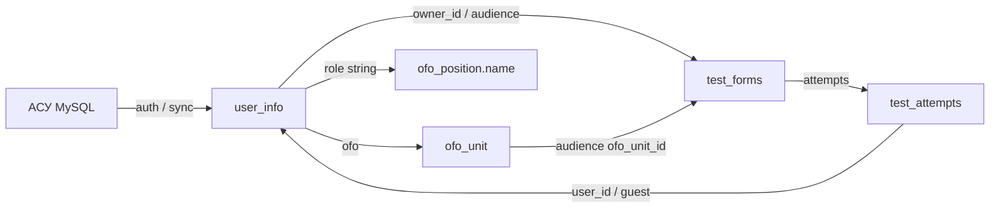

# Тесты, пользователи и ОФО

> Как сейчас устроены модуль тестов/форм, учётные записи сотрудников и организационно-функциональная структура (ОФО) в корпоративном портале.

Документ описывает **фактическую реализацию в коде**, а не целевой дизайн. Если поведение UI и API расходятся — это отмечено явно.

---

## Оглавление

1. [Модуль тестов](#1-модуль-тестов)
2. [Пользователи](#2-пользователи)
3. [ОФО](#3-офо)
4. [Связи между системами](#4-связи-между-системами)
5. [Известные ограничения](#5-известные-ограничения)

---

## 1. Модуль тестов

### 1.1 Две параллельные системы

В репозитории живут **два независимых стека**. Они не шарят таблицы и почти не шарят UI.

| | Активный модуль (основной) | Легаси |
|--|---------------------------|--------|
| Маршрут | `/tests` → `TestsBlankPage.vue` | `/tests/old` → `TestsPage.vue`; киоск `/kiosk/tests` |
| Публичная ссылка | `/t/:token` → `TestLinkPage.vue` | нет |
| БД | `test_*` (миграции V2, V3) | `forms`, `questions`, … (миграция V1) |
| ID | `bigint` identity | `uuid` |
| API | `api/tests_*.php` | `api/forms*.php` |
| Store | `src/composables/useTestsStore.ts` | Pinia `src/tests/store.ts` |
| Типы форм | `kind`: `test` \| `survey` \| `poll` | `mode`: `survey` \| `test` |
| Статусы | `draft` \| `published` | `draft` \| `published` \| `archived` |

Комментарий в `db/migration/V2__tests_module.sql`:

> Отдельная схема, не пересекается с легаси `public.forms/*`.

Дальше в этом разделе описан **активный** модуль. Легаси — в конце §1.9.

---

### 1.2 Модель данных (активный модуль)

Миграции: `db/migration/V2__tests_module.sql`, `V3__tests_link.sql`.

Жёстких FK на `user_info` / `ofo_unit` нет: таблицы синхронизируются извне, целостность проверяет API.

```
test_forms
  ├── test_questions
  │     └── test_options
  ├── test_audience_ofo      (ofo_unit_id)
  ├── test_audience_users    (user_id → user_info.id)
  └── test_attempts
        └── test_answers
              └── test_answer_options
```

#### `test_forms` — карточка формы

| Поле | Смысл |
|------|--------|
| `id` | Внутренний ID |
| `list_no` | Публичный номер в «Списке»; выдаётся **только при первой публикации** (`test_forms_list_no_seq`), дальше не меняется и не переиспользуется |
| `status` | `draft` \| `published` |
| `owner_id` | `user_info.id` создателя |
| `kind` | `test` (с баллами) \| `survey` (опрос) \| `poll` (голосование) |
| `visibility` | `public` (видно всем в «Все формы») \| `private` (свои + направленная аудитория) |
| `title`, `description`, `completion_message` | Тексты |
| `shuffle`, `shuffle_options` | Перемешивание вопросов / вариантов |
| `show_progress`, `free_navigation` | Прогресс и свободная навигация по вопросам |
| `anonymous` | Анонимные ответы |
| `allow_change_answer`, `live_results`, `allow_revote` | В основном для poll |
| `use_passing_score`, `passing_score` | Проходной балл (0–100), только для `kind=test` |
| `show_correct_answers` | Показывать правильные ответы |
| `restrict_by_ofo` | Ограничение аудитории по ОФО |
| `use_time_limit`, `time_limit_sec` | Лимит времени |
| `limit_attempts`, `attempts` | Лимит попыток |
| `use_start` / `starts_at`, `use_end` / `ends_at` | Окно доступности |
| `show_result` | `immediate` \| `after` \| `never` |
| `access_by_link`, `access_token` | Доступ по ссылке |
| `link_access` (V3) | `authorized` \| `guest` \| `any` |

#### `test_questions` / `test_options`

Типы вопросов:

| `type` | В UI | Правильный ответ |
|--------|------|------------------|
| `single` | Один из списка | флаг `is_correct` у варианта |
| `multiple` | Несколько из списка | набор `is_correct` |
| `dropdown` | Выпадающий список | `is_correct` |
| `text` / `textarea` | Короткий / развёрнутый текст | `correct_value` |
| `scale` | Шкала (`scale_min`…`scale_max`) | `correct_value` |
| `yesno` | Да / Нет | `correct_value` (`yes`/`no`) |
| `number` | Число | `correct_value` |
| `date` | Дата | `correct_value` |

На фронте модель вопроса: `src/pages/Tests/questionTypes.ts` (`QType`, `Question`, `correct`).

#### Аудитория

- `test_audience_ofo` — подразделения (`ofo_unit_id`), `source`: `initial` \| `directed`
- `test_audience_users` — персональные назначения (`user_id`), тот же `source`

«Направить» после публикации идёт через `tests_direct.php` (может вернуть `needConfirm`, если адресат уже в аудитории).

#### Попытки и ответы

`test_attempts`:

| Поле | Смысл |
|------|--------|
| `user_id` | `NULL` = гость / аноним |
| `session_token` | UUID сессии (в UI «Продолжить» **не используется** — см. ограничения) |
| `status` | `in_progress` \| `completed` \| `expired` |
| `score`, `max_score`, `passed` | Результат |
| `via_link`, `respondent_token`, `guest_name`, `guest_ofo_id` | Прохождение по ссылке (V3) |

Ответы: `test_answers` + выбранные варианты в `test_answer_options`.

---

### 1.3 Виды форм (`kind`)

| Kind | Назначение | Особенности |
|------|------------|-------------|
| `test` | Проверка знаний | Подсчёт баллов, проходной порог, показ правильных ответов |
| `survey` | Опрос | Можно сделать анонимным; без скоринга |
| `poll` | Голосование | Обычно один вопрос, `anonymous` принудительно; флаги `allow_revote`, `live_results` |

`visibility`:

- **public** — попадает в блок «Все формы» у сотрудников
- **private** — видна владельцу; пройти на портале могут только направленные пользователи/ОФО (проверка в `tests_submit.php`)

---

### 1.4 Пользовательские сценарии

#### Создание и публикация (админ UI)

1. Пользователь с UI-ролью `admin` открывает `/tests`.
2. Вкладки **Конструктор** / **Статистика** доступны только при `currentRole === 'admin'` (`TestsBlankPage.vue`).
3. `TestBuilder.vue` редактирует метаданные, вопросы (`QuestionsBuilder.vue`), ограничения, доступ по ссылке.
4. **Сохранить черновик** → `POST /api/tests_save.php` → `tf_persistForm` (статус не меняется).
5. **Опубликовать** → `POST /api/tests_publish.php` → persist + `status=published`, присваивается `list_no` (если ещё `NULL`), при `access_by_link` генерируется `access_token`.
6. **Снять с публикации** → `tests_unpublish.php` → снова `draft` (**`list_no` сохраняется**).
7. **Удалить** можно только черновик → `tests_delete.php`.

> На API нового модуля **нет проверки `user_group`/`role=admin`**. Идентичность — поле `userId` в теле запроса. Ограничение «только админ» сейчас на стороне UI.

#### Прохождение на портале (авторизованный)

- Вкладка **Список → Все формы**: опубликованные `public`.
- **Тесты для меня**: формы, направленные на пользователя или на его `user_info.ofo`.
- **Мои формы**: формы владельца; проходить отсюда нельзя (только через «Тесты для меня» / список).
- Раннер: `TestRunner.vue` → `POST tests_submit.php` с `formId` + `userId` из `localStorage['auth-user']`.
- Кнопка **Продолжить** хранит прогресс **только в `localStorage`** (`tests-sessions-v1`). Серверные `in_progress`-попытки раннером не подхватываются; при сабмите создаётся новая `completed`-попытка.

#### Публичная ссылка `/t/:token`

1. Маршрут с `meta.public: true` — guard авторизации пропускает (`src/router/index.js`).
2. `POST tests_by_token.php`: форма должна быть `published`, `access_by_link=true`, токен валиден; учитывается окно дат.
3. Лендинг по `link_access`:
   - `authorized` — нужен вход
   - `guest` — ФИО (+ опционально ОФО через `OfoSelect`)
   - `any` — оба варианта
4. Дедуп гостя: `localStorage['tests-respondent']` → `respondent_token`.
5. Сабмит: `tests_submit.php` с `token` и опционально `userId` / гостевыми полями.

#### Статистика

- Админ → вкладка **Статистика** → список `mine` → `StatsDetail.vue` → `POST tests_stats.php`.
- Детализация по участнику → `tests_participant.php` (только владелец, не анонимные; гости с отрицательными fake-id в UI туда не ходят).

Файл `useTestStats.ts` содержит демо-генератор `buildStats()` со случайными данными — **живой UI его не использует** для агрегатов; берёт ответ API. Из composable реально тянут типы/`fmtDuration`.

---

### 1.5 API активного модуля

Все endpoints: **POST**, JSON body, общий хелпер `api/tests_common.php` (`tf_assembleForm`, `tf_persistForm`, PDO).

Ответ: `{ success, message, data }`.

| Файл | Назначение |
|------|------------|
| `tests_list.php` | `{ drafts, published, mine, forMe }` |
| `tests_save.php` | Upsert содержимого (черновик/форма) |
| `tests_publish.php` | Persist + публикация |
| `tests_unpublish.php` | Published → draft |
| `tests_delete.php` | Удаление только draft |
| `tests_direct.php` | Добавить directed-аудиторию (ОФО/пользователи) |
| `tests_submit.php` | Завершить попытку (портал или по токену) |
| `tests_by_token.php` | Отдать форму для `/t/:token` |
| `tests_stats.php` | Агрегаты для UI статистики |
| `tests_participant.php` | Ответы одного участника для владельца |

Права на мутации: совпадение `userId` с `owner_id`. Создание формы «привязывается» к переданному `userId`.

---

### 1.6 Подсчёт баллов (`kind=test`)

Реализация: `api/tests_submit.php` (+ зеркальная логика превью в `TestRunner.vue`).

1. Вопрос считается оцениваемым, если задан правильный ответ (есть `is_correct` у вариантов или непустой `correct_value`).
2. Выбор (`single` / `dropdown` / `multiple`): точное совпадение множества выбранных option id (для multiple — сравнение отсортированных наборов).
3. Текст / yesno: сравнение без регистра, с trim.
4. Scale / number: числовое равенство.
5. Итог:

```
score     = round(correctCount / scorableCount * 100, 2)
max_score = 100
passed    = use_passing_score ? (score >= passing_score) : null/по правилам формы
```

Для `survey` / `poll` скоринг не применяется.

---

### 1.7 Фронтенд активного модуля

| Файл | Роль |
|------|------|
| `src/pages/TestsBlankPage.vue` | Оболочка: вкладки Список / Конструктор / Статистика |
| `src/pages/Tests/TestBuilder.vue` | Конструктор формы |
| `src/pages/Tests/QuestionsBuilder.vue` | Редактор вопросов |
| `src/pages/Tests/TestRunner.vue` | Прохождение |
| `src/pages/Tests/StatsDetail.vue`, `StatChart.vue` | Статистика |
| `src/pages/Tests/testForm.ts` | Модель формы на клиенте |
| `src/pages/Tests/questionTypes.ts` | Типы вопросов |
| `src/pages/TestLinkPage.vue` | Публичная ссылка |
| `src/composables/useTestsStore.ts` | Состояние списка/форм (module refs, не Pinia) |

Маршруты: `src/router/index.js` — `/tests`, `/tests/old`, `/t/:token`.

---

### 1.8 Легаси-модуль (кратко)

Схема V1: `users` (uuid) → `forms` → `questions` → `question_options`; `form_responses` → `response_answers`.

- Типы вопросов: `single_choice`, `multiple_choice`, `short_text`, `long_text`, `rating_1_10`, `select`, `file`.
- Скоринг: число верных choice/select; `score` = количество правильных, `max_score` = число оцениваемых.
- Админ для archive/delete/list на сервере: `user_info.role = 'admin'` + `auth` + `status` через заголовок `X-User-Id`.
- UI: `src/pages/TestsPage.vue`, `src/components/tests/*`, Pinia `src/tests/*`.
- Киоск до сих пор открывает **легаси** (`TestsPage`), не новый `/tests`.

Имена composable/store совпадают (`useTestsStore`) в двух местах — при импорте важен путь.

---

## 2. Пользователи

### 2.1 Источник данных

Основная таблица: **`public.user_info`** (PostgreSQL, БД `corporate_portal`).

DDL этой таблицы **нет** в `db/migration/` — схема унаследована / синхронизируется. Миграции тестов только ссылаются на `user_info.id` как на `bigint` без FK.

Отдельная таблица `public.users` (UUID) из V1 относится к **легаси-формам**, не к портальным сотрудникам.

Внешний источник: **АСУ** (MySQL) через:

- `api/auth.php` → `asu_lookup_and_create` при первом входе, если логина ещё нет в `user_info`
- `api/sync.php` — входящая синхронизация (`action: create` и др.)

---

### 2.2 Поля `user_info` (как используются в коде)

| Поле | Назначение |
|------|------------|
| `id` | PK; при создании из АСУ = id из АСУ (`ON CONFLICT (id) DO NOTHING`) |
| `login` | Логин для входа |
| `password` | Либо bcrypt-хеш (`password_verify`), либо **открытый** текст (`===`) — оба варианта принимаются |
| `status` | Аккаунт активен / заблокирован |
| `firstname`, `surname`, `lastname` | ФИО (из АСУ: Surname / Name / Patronymic) |
| `phone`, `email` | Контакты |
| `ofo` | ID подразделения; «не задано» = пусто или **`-1`** |
| `user_group` | Корзина привилегий UI: обычно `'admin'` \| `'user'`; из АСУ по умолчанию `'user'` |
| `role` | **Перегруженное поле**: чаще название должности (из `ofo_position.name`); в легаси-формах API также проверяется литерал `'admin'` |
| `auth` | Флаг «сейчас в системе» (`true` после логина) |
| `last_activity` | Время последней активности (heartbeat) |
| `avatar_url` | Аватар |

При создании из АСУ типичные дефолты: `ofo = -1`, `user_group = 'user'`, `role = ''`, `auth = false`, `status = true`.

---

### 2.3 Жизненный цикл сессии

Серверных cookie / JWT **нет**. Идентичность = `localStorage['auth-user']` + флаги в БД.

```
/login
  → POST /api/auth.php
  → localStorage auth-user = { id, fio, ofo, user_group, role }
  → онбординг (/welcome) или главная
  → heartbeat + периодический check-auth
  → logout или истечение 24ч idle
```

#### Вход (`api/auth.php`, `src/pages/login.vue`)

1. Ищем строку в `user_info` по `login`.
2. Если нет — запрос в АСУ; при успехе INSERT в `user_info`.
3. Проверка пароля (hash или plain).
4. Отказ, если `status = false`.
5. `UPDATE … SET auth = true, last_activity = now()`.
6. Ответ с урезанным `user`; клиент кладёт его в `localStorage`.

#### Проверка (`api/check-auth.php`)

Эффективная сессия жива, если одновременно:

- `auth = true`
- `status = true`
- `last_activity` не старше **24 часов**

Иначе API гасит `auth = false` (ленивый logout).

Клиент:

- Router: DB-check не чаще чем раз в **15 минут** (`auth-last-check`).
- `useSessionActivity.ts`: heartbeat не чаще **4 минут**; раз в минуту (и при фокусе вкладки) — check-auth; при `auth: false` — очистка и редирект на login.

#### Выход

`POST /api/logout.php` → `auth = false`; клиент чистит `auth-user` и `auth-last-check` (например, из `AppAside.vue`).

---

### 2.4 Онбординг и профиль

Онбординг обязателен, если профиль неполный (`useOnboarding.ts`):

- `ofo` пустой или `-1`
- пустой `role` (должность)
- пустой `avatar_url`

Маршрут `/welcome` (`OnboardingPage.vue`): выбор ОФО → должности → аватара → `POST /api/profile.php`.

Профиль (`ProfilePage.vue`):

- Чтение/запись через `api/profile.php`
- Отображаемое имя/подзаголовок/аватар частично кэшируются в localStorage (`useProfileDisplay.ts`)
- Стена постов — **только клиент** (`useProfileWall.ts`, ключ `profile-wall-posts:v2`), в БД не пишется

---

### 2.5 Роли: три разных «admin»

| Механизм | Где | Что даёт |
|----------|-----|----------|
| `localStorage['ui-role']` (`stores/role.js`) | Клиент | Режим UI: показ админ-страниц, конструктора тестов, редакторов новостей |
| `user_info.user_group` | БД | Кому разрешено **переключать** UI в admin (`useHeaderUser` → `canToggleAdminRole`) |
| `user_info.role === 'admin'` | БД + легаси forms API | Серверная проверка archive/delete/list через `X-User-Id` |

Киоск всегда форсит `currentRole = 'user'`.

Важно: в повседневной работе `role` хранит **название должности**. Если туда записать должность, серверный admin для легаси-форм перестанет совпадать с UI-admin через `user_group`. Это два разных контура.

---

### 2.6 Админка пользователей

`AdminDashboardPage.vue` (при `currentRole === 'admin'`):

- Список из `GET /api/users.php` (кэш `useUsersData.ts`)
- Поиск, фильтр по статусу и ОФО
- Смена статуса, правка полей (login, password, FIO, ofo, user_group, contacts, avatar, role) через `PUT /api/users.php?id=`
- Принудительный logout
- Impersonate — **заглушка** (alert), не рабочий сценарий

`GET /api/users.php` в ответе отдаёт и пароли; отдельной проверки «только админ» на endpoint в коде нет — доверяют сети/UI.

Дни рождения (`api/birthdays.php`) читают xlsx и сопоставляют аватары с `user_info` по ФИО — к ОФО не привязаны.

---

## 3. ОФО

### 3.1 Две модели структуры

В БД и API сосуществуют **два представления** ОФО.

#### A. Легаси: `public.ofo` + `public.ofo_seats`

| API | Данные |
|-----|--------|
| `GET /api/ofo.php` | `id, title, parent, type, sort_order` |
| `GET /api/ofo_seats.php` | `id, title, ofo, insurance, rating` |

Фронт: `useOfoData.ts` — названия для журнала отсутствия, админ-фильтры/бейджи, статистика мест.

#### B. Дерево подразделений (основное для выбора в UI)

| Таблица | Назначение |
|--------|------------|
| `ofo_category` | Категории верхнего уровня |
| `ofo_unit` | Подразделения: `id, name, category_id, parent_id, level, unit_number, family_number, sort_order` |
| `ofo_position` | Должности: `id, name, is_head, sort_order` |
| `ofo_unit_position` | Связь `unit_number` ↔ `position_id` |

| API | Поведение |
|-----|-----------|
| `GET /api/ofo_tree.php` | Категории + юниты; `position_count`, `user_count` (считает `user_info.ofo`, совпадающий с `ofo_unit.id` по числовому regex) |
| `GET /api/ofo_positions.php?unit_number=N` | Должности юнита; флаг руководителя `is_head` |

Фронт: `useOfoTree.ts`, `OfoSelect.vue`, `OfoMultiSelect.vue`, `AdminOfoPanel.vue`, онбординг/профиль, аудитория тестов.

DDL этих таблиц **тоже отсутствует** в Flyway-миграциях репозитория — только использование из PHP.

---

### 3.2 Связь сотрудника с ОФО

```
user_info.ofo     ──► ofo_unit.id     (онбординг, профиль, тесты, дерево)
                  ──► ofo.id ?        (легаси-названия в absence / admin filter через ofo.php)

user_info.role    ◄── ofo_position.name   (в БД хранится строка-название, не FK на position.id)
```

- Незаданное ОФО: `isOfoUnset()` — пусто или `'-1'`.
- В UI выбора: `OfoSelect` биндит `ofo_unit.id` → сохраняет в `user_info.ofo` строкой.
- ID должности в БД **не сохраняется** — только имя в `role`. Переименование должности в справочнике ломает «совпадение» со старыми профилями.

**Места (`ofo_seats`)** используются для аналитики в админке, в сохранение профиля не входят.

---

### 3.3 UI-компоненты выбора

| Компонент | Поведение | Источник |
|-----------|-----------|----------|
| `OfoSelect.vue` | Один юнит, поиск по дереву | `ofo_tree.php` |
| `OfoMultiSelect.vue` | Несколько юнитов + каскад потомков | `ofo_tree.php` |
| `AdminOfoPanel.vue` | Обзор дерева + счётчики сотрудников (read-only) | `ofo_tree.php` |
| Фильтр пользователей в админке | Сравнение `user.ofo` со строкой фильтра | часто через `useOfoData` / `ofo.php` |
| Конструктор тестов | `restrictByOfo` + multi-select → `test_audience_ofo` | дерево |
| Гостевая ссылка теста | Опциональный выбор ОФО → `guest_ofo_id` | дерево |
| Журнал отсутствия | Фильтр `?ofo=`; подписи из `ofo.php` | **легаси** |

CRUD для создания/редактирования узлов ОФО в этом репозитории **нет** — только чтение. Изменение структуры, видимо, снаружи (синхронизация/ручные SQL).

---

## 4. Связи между системами



| Модуль | Как использует пользователей / ОФО |
|--------|-------------------------------------|
| **Тесты (новый)** | `owner_id`; `test_audience_users.user_id`; `test_audience_ofo.ofo_unit_id` сравнивается с `user_info.ofo`; гость — `guest_ofo_id` |
| **Журнал отсутствия** | `user_id`, денормализованные `ofo` и `role` на момент записи; названия через легаси `ofo.php` |
| **Формы (легаси)** | Админ по `user_info.role='admin'` + `X-User-Id` |
| **Онбординг / профиль** | Обязательные `ofo` + `role` + `avatar_url` |
| **Дни рождения** | Сопоставление по ФИО → `avatar_url` |

Список «Тесты для меня» (`tests_list.php`): читает `user_info.ofo` текущего пользователя и пересекает с `test_audience_ofo` / `test_audience_users`.

---

## 5. Известные ограничения

1. **Два стека тестов** — разные БД/API/UI; киоск на легаси.
2. **Два графа ОФО** — дерево (`ofo_unit`) vs плоское `ofo`/`ofo_seats`; id должны «совпадать по смыслу», но это не гарантировано схемой.
3. **`role` перегружен** — должность в UI vs `'admin'` в легаси forms API.
4. **UI-admin ≠ server-admin** для нового модуля тестов: API доверяет `userId` в теле.
5. **Resume попытки** на клиенте (localStorage), не через `test_attempts.in_progress`.
6. **Должность без FK** — только строка в `user_info.role`.
7. **Нет DDL** для `user_info` и ОФО-таблиц в репозитории миграций.
8. **Секреты/пароли**: часть PHP с захардкоженными креденшелами БД; `users.php` отдаёт password-поля.
9. **Стена профиля** и часть display-кэша — только браузер.
10. Коллизия имени `useTestsStore` (composable vs Pinia).

---

## Карта файлов

### Тесты

```
db/migration/V1__init_schema.sql      # легаси forms
db/migration/V2__tests_module.sql     # активный модуль
db/migration/V3__tests_link.sql       # ссылки / гости

api/tests_*.php                       # активный API
api/tests_common.php
api/forms*.php                        # легаси API

src/pages/TestsBlankPage.vue
src/pages/TestLinkPage.vue
src/pages/Tests/*
src/composables/useTestsStore.ts
src/pages/TestsPage.vue               # легаси UI
src/components/tests/*
src/tests/*                           # Pinia + Zod легаси
```

### Пользователи

```
api/auth.php, check-auth.php, logout.php, heartbeat.php
api/users.php, profile.php, sync.php, birthdays.php

src/pages/login.vue
src/pages/OnboardingPage.vue
src/pages/ProfilePage.vue
src/pages/Admin/AdminDashboardPage.vue
src/composables/useUsersData.ts
src/composables/useHeaderUser.ts
src/composables/useOnboarding.ts
src/composables/useProfileDisplay.ts
src/composables/useProfileWall.ts
src/composables/useSessionActivity.ts
src/stores/role.js
```

### ОФО

```
api/ofo.php, ofo_seats.php            # легаси
api/ofo_tree.php, ofo_positions.php   # дерево

src/composables/useOfoData.ts
src/composables/useOfoTree.ts
src/components/OfoSelect.vue
src/components/OfoMultiSelect.vue
src/components/AdminOfoPanel.vue
```
